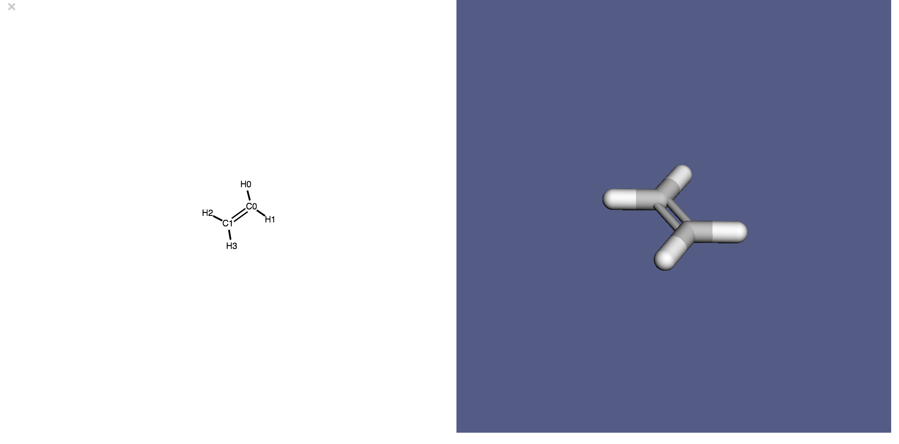
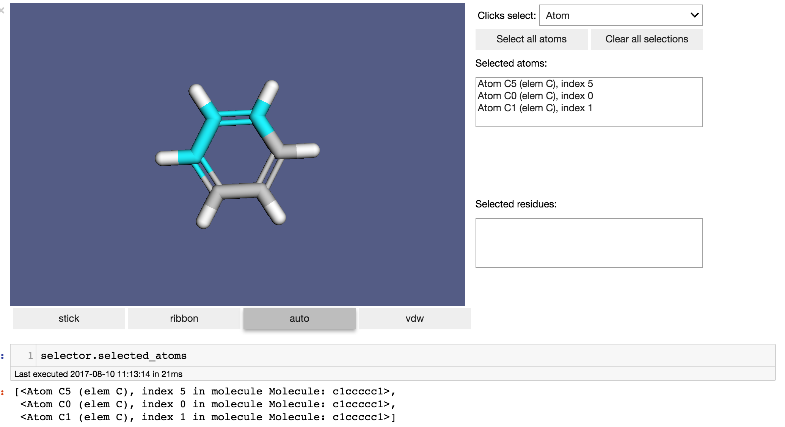

notebook-molecular-visualization
===============================
[](https://badge.fury.io/py/nbmolviz)

Jupyter notebook add-ons for the [Molecular Design Toolkit](https://github.com/Autodesk/molecular-design-toolkit). NBMolViz provides visualization and interactivity for 3D Molecular Structures in Jupyter notebooks.

After installing it, you'll never need to use the NBMolViz package directly. It's instead called through MDT to provide enhanced functionality in notebooks. 

## Installation
When you install `nbmolviz`, you'll need to both install the python library _and_ enable the notebook extensions. 

1. **Install the python library:**
```bash
    $ pip install nbmolviz
```
    
2. **Activate notebook extensions:**
To enable for your user account:
```bash
    $ python -m nbmolviz activate --user
```
       
To enable within your current virtual environment:
```bash
    $ python -m nbmolviz activate --sys-prefix
```

To globally enable for all users (use with caution! This may require `sudo`):
```bash
    $ python -m nbmolviz activate --global
```

## Upgrading from older versions

1. **Upgrade the library to the newest version**
    $ pip install --upgrade nbmolviz

2. **Remove old notebook extensions (you will be notified if it's necessary to run with `sudo`)**:
```bash
    $ python -m nbmolviz uninstall
```

3. Activate the notebook extension as above


## Examples

Draw a small molecule:
```python
import moldesign as mdt
mol = mdt.from_name('ethylene')
mol.draw()
```


Draw a protein:
```python
import moldesign as mdt
mol = mdt.from_pdb('3aid')
mol.draw()
```


Interactively select atoms (the currently selected atoms will be available as `selector.selected_atoms`)
```python
import moldesign as mdt
mol = mdt.from_pdb('3aid')
selector = mdt.widgets.ResidueSelector(mol)
selector
```



## Dev install
Requires npm.

    $ git clone https://github.com/autodesk/notebook-molecular-visualization
    $ cd notebook-molecular-visualization
    # ./set_filters.sh  # tells git to clean up notebooks before committing
    $ python setup.py jsdeps
    $ pip install -e .
    $ jupyter nbextension install --py --symlink --user nbmolviz
    $ jupyter nbextension enable --py --user nbmolviz
    $ cd tests/galileo && npm install
    
This will build your widgets into a folder at `notebook-molecular-visualization/nbmolviz/static`

During development, to see the effects of changes to any javascript files (in notebook-molecular/visualization/js/src), run `python setup.py jsdeps` and reload any notebook browser windows.

## To run visual tests
`cd tests/nb && ../galileo/bin/galileo --launchnb`

## Releasing a new version
Travis automatically releases commits that are tagged, so to trigger a new release, just do:

    git tag <new tag version>
    git push origin --tags

If you want to see what will be included in a release, run `check-manifest`.  You could also manually build a release with `python setup.py sdist` and manually release with `python setup.py sdist upload -r pypi`.

## Contributing

This project is developed and maintained by the [Molecular Design Toolkit](https://github.com/autodesk/molecular-design-toolkit) project. Please see that project's [CONTRIBUTING document](https://github.com/autodesk/molecular-design-toolkit/CONTRIBUTING.md) for details.


## About
This package started life as hackathon project for the <a href="http://www.cecam.org/workshop-1214.html">CECAM 2015 Macromolecular Simulation Workshop.</a> It's since undergone a complete source rewrite, and is being released by BioNano Research at Autodesk as part of our suite of Molecular Design Tools.

The visualizers offered by this library were built using:
  - <a href="https://github.com/jupyter/ipywidgets">ipywidgets</a> - UI library for interactivity in Jupyter notebooks
  - <a href="http://3dmol.csb.pitt.edu/doc/index.html">3Dmol.js</a> - 3D molecular visualization library for web browsers
  - <a href="http://d3js.org/">D3.js</a> - javascript library for graph visualization


## License

Copyright 2017 Autodesk Inc.

Licensed under the Apache License, Version 2.0 (the "License"); you may not use this file except in compliance with the License. You may obtain a copy of the License at

http://www.apache.org/licenses/LICENSE-2.0

Unless required by applicable law or agreed to in writing, software distributed under the License is distributed on an "AS IS" BASIS, WITHOUT WARRANTIES OR CONDITIONS OF ANY KIND, either express or implied. See the License for the specific language governing permissions and limitations under the License.
